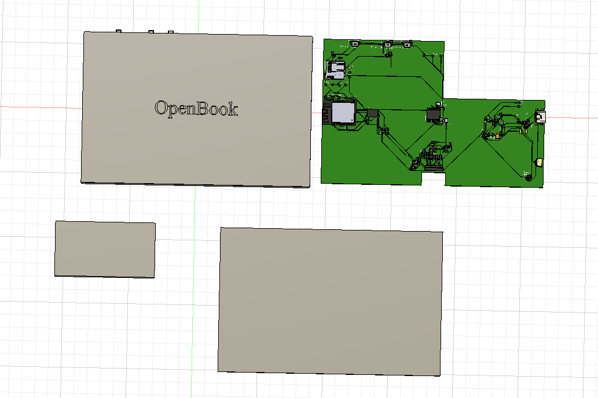
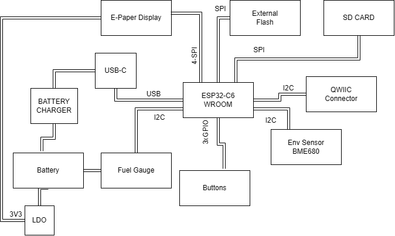
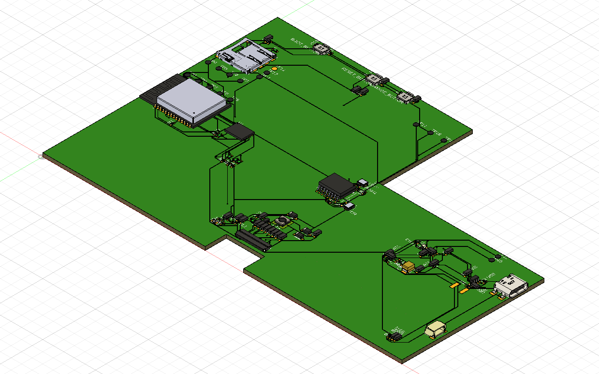
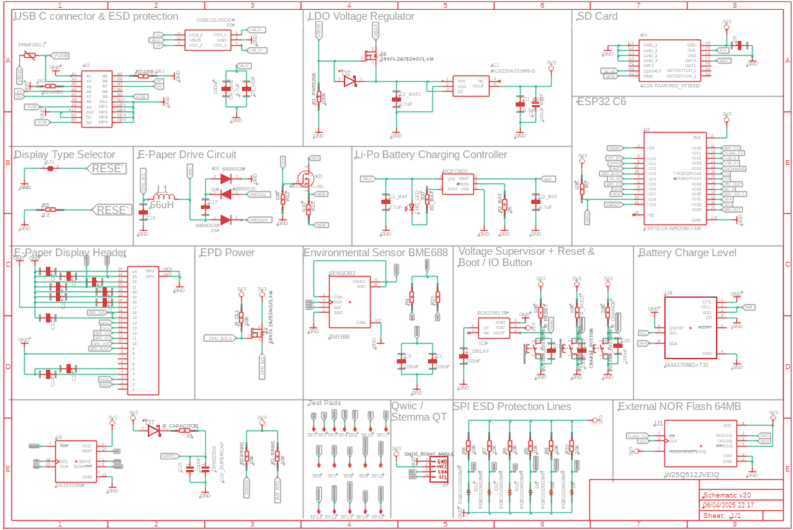

# OpenBook
Proiect TSC - Serbu Ovidiu Madalin

## Block Diagram

## Components

- **Microcontroller:** ESP32-C6 with integrated Wi-Fi 6 and Bluetooth 5 — responsible for core processing, communication, and power management.
- **Display:** 800×480 resolution e-Paper (e-Ink) display interfaced via SPI — ideal for low-power, high-visibility content rendering.
- **Sensors:** BME688 environmental sensor (temperature, humidity, pressure, air quality) connected through I2C.
- **Power Supply:** 2500mAh LiPo battery with USB-C charging and integrated fuel gauge for real-time battery monitoring.
- **Storage:** MicroSD card slot for storing e-books and other resources, communicating via SPI.
- **Real-Time Clock:** DS3231 RTC module with battery backup for accurate timekeeping even during power loss.
- **User Inputs:** 3 buttons (connected via GPIO) for navigation and control.
- **Expansion Options:** QWIIC/Stemma QT connector for easy integration of additional sensors or modules.

## Bill Of Materials

|                                   name                                   	|        value       	| description                                                           	| quantity 	|                                                                                                                                                     link                                                                                                                                                    	| datasheet                                                                                                                           	|
|:------------------------------------------------------------------------:	|:------------------:	|-----------------------------------------------------------------------	|:--------:	|:-----------------------------------------------------------------------------------------------------------------------------------------------------------------------------------------------------------------------------------------------------------------------------------------------------------:	|-------------------------------------------------------------------------------------------------------------------------------------	|
| LED1                                                                     	|          -         	| LED                                                                   	| 1        	| [link](https://www.niden.ro/led-uri-smd/4560-led-smd-0603-alb-rece.html)                                                                                                                                                                                                                                    	| [link](https://www.mouser.com/datasheet/2/423/LSM0603472V_(1)-1379786.pdf?srsltid=AfmBOoqdcB2pVIrWRImdZdFZcxn5SIjNLKeNM1u-ULY7G7UgiZHJYMAt)	|
| C18                                                                      	|      0.1uF/50V     	| CAPACITOR, European symbol                                            	| 1        	| [link](https://ro.mouser.com/ProductDetail/KEMET/C0402C104K4RAC7411?qs=GedzDrHbfJPMv36lRRfk4g%3D%3D)                                                                                                                                                                                                                	| [link](https://ro.mouser.com/datasheet/2/447/KEM_C1002_X7R_SMD-3316098.pdf)                                                                 	|
| R5                                                                       	|        0.47        	| RESISTOR, European symbol                                             	| 1        	| [link](https://ro.mouser.com/ProductDetail/ROHM-Semiconductor/SFR01MZPJ471?qs=sGAEpiMZZMtlubZbdhIBIONtIqra%2FA5YbUieG7R0owU%3D)                                                                                                                                                                                     	| [link](https://fscdn.rohm.com/en/products/databook/datasheet/passive/resistor/chip_resistor/sfr-e.pdf)                                      	|
| R1                                                                       	|        100K        	| RESISTOR, European symbol                                             	| 1        	| [link](https://ro.mouser.com/ProductDetail/Bourns/CR0402-FX-1003GLF?qs=URDPQ%2Fj0cz1ZruPSJQ7fsA%3D%3D&utm_id=6470900573&utm_source=google&utm_medium=cpc&utm_marketing_tactic=emeacorp&gad_source=1&gclid=CjwKCAjwzMi_BhACEiwAX4YZUExf8o5xv9o__WAln9moW8yaWJv0M179-dCfAxoyQP6_ulvhYGGM9xoCahIQAvD_BwE)              	| [link](https://ro.mouser.com/datasheet/2/54/cr-1858361.pdf)                                                                                 	|
| C1, C5, C21, C22, C23, C25, C26, C27                                     	|        100nF       	| CAPACITOR, European symbol                                            	| 8        	| [link](https://ro.mouser.com/ProductDetail/KEMET/C0402C104K4RAC7411?qs=GedzDrHbfJPMv36lRRfk4g%3D%3D)                                                                                                                                                                                                                	| [link](https://ro.mouser.com/datasheet/2/447/KEM_C1002_X7R_SMD-3316098.pdf)                                                                 	|
| C2                                                                       	|        100uF       	| POLARIZED CAPACITOR, European symbol                                  	| 1        	| [link](https://ro.mouser.com/ProductDetail/KEMET/T491B107M006AT?qs=U312oeP%2FpiHOgyk6KO2m0g%3D%3D)                                                                                                                                                                                                                  	| [link](https://ro.mouser.com/datasheet/2/447/KEM_T2005_T491-3316937.pdf)                                                                    	|
| R18                                                                      	|         10K        	| RESISTOR, European symbol                                             	| 1        	| [link](https://ro.mouser.com/ProductDetail/Vishay-Dale/CRCW040210K0FKEDC?qs=E3Y5ESvWgWPiNLcGzwCGPg%3D%3D)                                                                                                                                                                                                           	| [link](https://www.vishay.com/docs/28773/crcwce3.pdf)                                                                                       	|
| R6, R10, R11, R12, R13, R14, R15, R16, R19, R20, R21, R22, R23, R24, R25 	|         10k        	| RESISTOR, European symbol                                             	| 15       	| [link](https://ro.mouser.com/ProductDetail/Vishay-Dale/CRCW040210K0FKEDC?qs=E3Y5ESvWgWPiNLcGzwCGPg%3D%3D)                                                                                                                                                                                                           	| [link](https://www.vishay.com/docs/28773/crcwce3.pdf)                                                                                       	|
| C7                                                                       	|        10uF        	| CAPACITOR, European symbol                                            	| 1        	| [link](https://ro.mouser.com/ProductDetail/KEMET/C0402C106M7PAC7867?qs=kZJHmUDErizJnkDIcqVWRQ%3D%3D)                                                                                                                                                                                                                	| [link](https://ro.mouser.com/datasheet/2/447/KEM_C1006_X5R_SMD-3316465.pdf)                                                                 	|
| J1                                                                       	|          -         	| Micro SD Card Socket, Push-Push Type, Top   Mount, SMT, H=1.83mm, 10u 	| 1        	| [link](https://www.digikey.ro/en/products/detail/attend-technology/112A-TAAR-R03/17633923)                                                                                                                                                                                                                          	| [link](https://www.attend.com.tw/data/download/file/112A-TAAR-R03_Spec.pdf)                                                                 	|
| R17                                                                      	|         15         	| RESISTOR, European symbol                                             	| 1        	| [link](https://www.soselectronic.com/ro-ro/products/yageo/r0402-5-15-r-rc0402jr-0715rl-1-81614)                                                                                                                                                                                                                     	| [link](https://cdn.soselectronic.com/productdata/4b/af/65353ac1/r0402-1-1-5-k-rc0402fr-071k5l-1.pdf)                                        	|
| C24                                                                      	|         1uF        	| CAPACITOR, European symbol                                            	| 1        	| [link](https://ro.mouser.com/ProductDetail/KEMET/C0402C105Z9VACTU?qs=gt1LBUVyoHlQieoJt4iw1w%3D%3D)                                                                                                                                                                                                                  	| [link](https://ro.mouser.com/datasheet/2/447/KEM_C1005_Y5V_SMD-3316374.pdf)                                                                 	|
| C11, C12, C13, C14, C15, C16, C17, C19, C20                              	|       1uF/50V      	| CAPACITOR, European symbol                                            	| 9        	| [link](https://ro.mouser.com/ProductDetail/KEMET/C0402C105Z9VACTU?qs=gt1LBUVyoHlQieoJt4iw1w%3D%3D)                                                                                                                                                                                                                  	| [link](https://ro.mouser.com/datasheet/2/447/KEM_C1005_Y5V_SMD-3316374.pdf)                                                                 	|
| R7                                                                       	|         2.2        	| RESISTOR, European symbol                                             	| 1        	| [link](https://ro.mouser.com/ProductDetail/Panasonic/ERJ-PA2J2R2X?qs=sGAEpiMZZMtlubZbdhIBIKn8wLs5z3UnO%252BN6Zqj8Y2A%3D)                                                                                                                                                                                            	| [link](https://industrial.panasonic.com/cdbs/www-data/pdf/RDO0000/AOA0000C331.pdf)                                                          	|
| R8                                                                       	|         200        	| RESISTOR, European symbol                                             	| 1        	| [link](https://ro.mouser.com/ProductDetail/Vishay-Thin-Film/PNM0402E2000BSTS?qs=sGAEpiMZZMvdGkrng054t2cqbZCzJY7NtycrwNLdAiqcSryq%252B1Rhtw%3D%3D)                                                                                                                                                                   	| [link](https://www.vishay.com/docs/60057/pnm.pdf)                                                                                           	|
| Q1, Q3                                                                   	| 20V/4.2A/52mO/1.4W 	| P-channel MOSFETs                                                     	| 2        	| [link](https://www.digikey.ro/en/products/detail/vishay-siliconix/SI1308EDL-T1-GE3/4876435?utm_campaign=buynow&utm_medium=aggregator&utm_source=snapeda)                                                                                                                                                            	| [link](https://www.vishay.com/docs/63399/si1308edl.pdf)                                                                                     	|
| R9                                                                       	|         2k         	| RESISTOR, European symbol                                             	| 1        	| [link](https://ro.mouser.com/ProductDetail/Vishay-Dale/CRCW04022K00FKEE?qs=raETa%252B32nO8lGcRW9MjUBA%3D%3D)                                                                                                                                                                                                        	| [link](https://www.vishay.com/docs/20035/dcrcwe3.pdf)                                                                                       	|
| C6, C9, C10                                                              	|        4.7uF       	| CAPACITOR, European symbol                                            	| 3        	| [link](https://ro.mouser.com/ProductDetail/KEMET/C0402C475K8PACTU?qs=ulEaXIWI0c9ebKRT3r3htg%3D%3D)                                                                                                                                                                                                                  	| [link](https://ro.mouser.com/datasheet/2/447/KEM_C1006_X5R_SMD-3316465.pdf)                                                                 	|
| C3, C4                                                                   	|        4.7uF       	| CAPACITOR, European symbol                                            	| 2        	| [link](https://ro.mouser.com/ProductDetail/KEMET/C0402C475K8PACTU?qs=ulEaXIWI0c9ebKRT3r3htg%3D%3D)                                                                                                                                                                                                                  	| [link](https://ro.mouser.com/datasheet/2/447/KEM_C1006_X5R_SMD-3316465.pdf)                                                                 	|
| C8                                                                       	|      4.7uF/25V     	| CAPACITOR, European symbol                                            	| 1        	| [link](https://ro.mouser.com/ProductDetail/KEMET/C0402C475K8PACTU?qs=ulEaXIWI0c9ebKRT3r3htg%3D%3D)                                                                                                                                                                                                                  	| [link](https://ro.mouser.com/ProductDetail/KEMET/C0402C475K8PACTU?qs=ulEaXIWI0c9ebKRT3r3htg%3D%3D)                                          	|
| D3                                                                       	|      4.7uF/25V     	| ON SEMICONDUCTOR - MBR0530 - DIODE,   SCHOTTKY, 0.5A, 30V, SOD-123    	| 1        	| [link](https://www.snapeda.com/parts/MBR0530/Onsemi/view-part/?ref=eda)                                                                                                                                                                                                                                             	| [link](https://www.snapeda.com/parts/MBR0530/ON%20Semiconductor/datasheet/)                                                                 	|
| R3, R4                                                                   	|         5k1        	| RESISTOR, European symbol                                             	| 2        	| [link](https://www.gme.cz/v/1484336/yageo-r0402-5k1-006w-1-smd-rezistor?srsltid=AfmBOooJFe0JuMtJCHsiAAMzt535X2PaRQWliIdlncts6E1iAX--2xYh)                                                                                                                                                                           	| [link](https://img.gme.cz/files/eshop_data/eshop_data/7/984-017/dsh.984-017.1.pdf)                                                          	|
| L1                                                                       	|        68uH        	| coil                                                                  	| 1        	| [link](https://ro.mouser.com/ProductDetail/Wurth-Elektronik/744043680?qs=PGXP4M47uW6VkZq%252BkzjrHA%3D%3D)                                                                                                                                                                                                          	| [link](https://www.we-online.com/components/products/datasheet/744043680.pdf)                                                               	|
| IC2                                                                      	|          -         	| Voltage Detector with Adjustable Delay                                	| 1        	| [link](https://ro.mouser.com/ProductDetail/ROHM-Semiconductor/BD5229G-TR?qs=4kLU8WoGk0vvnhrrYwdszw%3D%3D)                                                                                                                                                                                                           	| [link](https://fscdn.rohm.com/en/products/databook/datasheet/ic/power/voltage_detector/bd52xxg-e.pdf)                                       	|
| BOOT_BUTTON, CHANGE_BUTTON, RESET_BUTTON                                 	|          -         	| Button                                                                	| 3        	| [link](https://ro.mouser.com/ProductDetail/CK/PTS841-GK-SMTR-LFS?qs=d0WKAl%252BL4KbAtAqJT9yhkg%3D%3D)                                                                                                                                                                                                               	| [link](https://www.ckswitches.com/media/2805/pts841.pdf)                                                                                    	|
| C28                                                                      	|          -         	| Cap 0.011F 3.3V 1210 Flat                                             	| 1        	| [link](https://www.snapeda.com/parts/CPH3225A/Seiko+Instruments/view-part/?ref=eda)                                                                                                                                                                                                                                 	| [link](https://www.snapeda.com/parts/CPH3225A/Seiko%20Instruments/datasheet/)                                                               	|
| U5                                                                       	|          -         	| Real Time Clock Serial 16-Pin SOIC W   T/R                            	| 1        	| [link](https://www.snapeda.com/parts/DS3231SN%23/Analog+Devices/view-part/?ref=eda)                                                                                                                                                                                                                                 	| [link](https://www.snapeda.com/parts/DS3231SN%23/Analog%20Devices/datasheet/)                                                               	|
| U2                                                                       	|          -         	| ESP32                                                                 	| 1        	| [link](https://www.snapeda.com/parts/ESP32-C6-WROOM-1-N8/Espressif+Systems/view-part/?ref=eda)                                                                                                                                                                                                                      	| [link](https://www.snapeda.com/parts/ESP32-C6-WROOM-1-N8/Espressif%20Systems/datasheet/)                                                    	|
| R2                                                                       	|          -         	| VARISTOR                                                              	| 1        	| [link](https://www.digikey.ro/en/products/detail/epcos-tdk-electronics/B72580T0110K062/15903564)                                                                                                                                                                                                                    	| [link](https://www.tdk-electronics.tdk.com/inf/75/db/CTVS_14/Standard_series.pdf)                                                           	|
| D1, D6                                                                   	|          -         	| Schottky Barrier Rectifier Diode                                      	| 2        	| [link](https://eu.mouser.com/ProductDetail/KYOCERA-AVX/SD0805S020S1R0?qs=jCA%252BPfw4LHbpkAoSnwrdjw%3D%3D&srsltid=AfmBOoos7vAXHpuNsFyDZDH2ms56jfFYgACPLwGeQRLBDVu-QQCPVRyy)                                                                                                                                         	| [link](https://ro.mouser.com/datasheet/2/40/schottky-3165252.pdf)                                                                           	|
| U3                                                                       	|          -         	| Integrated Environmental Unit                                         	| 1        	| [link](https://ro.mouser.com/ProductDetail/Bosch-Sensortec/BME680?qs=v271MhAjFHjo0yA%2FC4OnDQ%3D%3D)                                                                                                                                                                                                                	| [link](https://ro.mouser.com/datasheet/2/783/BST_BME680_DS001-1509608.pdf)                                                                  	|
| U1                                                                       	|          -         	| MCP73831T Li-Ion, Li-Pol Controller                                   	| 1        	| [link](https://eu.mouser.com/ProductDetail/Microchip-Technology/MCP73831T-2ACI-OT?qs=yUQqVecv4qvbBQBGbHx0Mw%3D%3D&utm_id=20109199409&utm_source=google&utm_medium=cpc&utm_marketing_tactic=emeacorp&gad_source=1&gclid=CjwKCAjwzMi_BhACEiwAX4YZUFXFfoOvOVw-rJ3AqbhBnSMrJwio_-4FjBZgwNJVbUQHlwwnAKDqhBoCYr4QAvD_BwE) 	| [link](https://ro.mouser.com/datasheet/2/268/MCP73831_Family_Data_Sheet_DS20001984H-3441711.pdf)                                            	|
| J3                                                                       	|          -         	|  (0.50mm) Surface Mount, Right Angle                                  	| 1        	| [link](https://ro.mouser.com/ProductDetail/Hirose-Connector/FH34SRJ-24S-0.5SH99?qs=vcbW%252B4%252BSTIpKBl5ap9J8Fw%3D%3D&_gl=1*l9suft*_ga*MTI5Mzc0MzA3OS4xNzQzODQ5MDQz*_ga_15W4STQT4T*MTc0Mzk1NTYyNy40LjAuMTc0Mzk1NTYyNy42MC4wLjA.)                                                                                  	| [link](https://ro.mouser.com/datasheet/2/185/FH34SRJ_24S_0_5SH_99__CL0580_1255_6_99_2DDrawing_0-1615044.pdf)                                	|
| U4                                                                       	|          -         	| 3µA 1-Cell/2-Cell Fuel Gauge with ModelGauge                          	| 1        	| [link](https://www.snapeda.com/parts/MAX17048G+T10/Analog+Devices/view-part/?ref=eda)                                                                                                                                                                                                                               	| [link](https://www.snapeda.com/parts/MAX17048G+T10/Analog%20Devices/datasheet/)                                                             	|
| D4, D5                                                                   	|          -         	| DIODE,   SCHOTTKY, 0.5A, 30V, SOD-123                                 	| 2        	| [link](https://www.snapeda.com/parts/MBR0530/Onsemi/view-part/?ref=eda)                                                                                                                                                                                                                                             	| [link](https://www.snapeda.com/parts/MBR0530/ON%20Semiconductor/datasheet/)                                                                 	|
| D7, D8, D9, D10, D11, D12                                                	|          -         	| Ipp Tvs Diode                                                         	| 6        	| [link](https://www.snapeda.com/parts/PGB1010603MR/Littelfuse/view-part/?ref=eda)                                                                                                                                                                                                                                    	| [link](https://www.snapeda.com/parts/PGB1010603MR/Littelfuse%20Inc./datasheet/)                                                             	|
| J4                                                                       	|          -         	| SparkFun I2C Standard Qwiic Connector                                 	| 1        	| [link](https://www.sparkfun.com/qwiic-jst-connector-smd-4-pin-horizontal.html)                                                                                                                                                                                                                                      	| [link](https://cdn.sparkfun.com/assets/parts/1/2/2/8/9/Qwiic_Connector_Datasheet.pdf)                                                       	|
| J2                                                                       	|          -         	| CONN USB 2.0 TYPE-C R/A SMT                                           	| 1        	| [link](https://ro.mouser.com/ProductDetail/GCT/USB4110-GF-A?qs=KUoIvG%2F9IlYiZvIXQjyJeA%3D%3D)                                                                                                                                                                                                                      	| [link](https://ro.mouser.com/datasheet/2/837/GCT_USB4110_Product_Drawing___20k_cycles-3455479.pdf)                                          	|
| Q2                                                                       	|          -         	| MOSFET N-Ch 30V 1.5A                                                  	| 1        	| [link](https://www.snapeda.com/parts/SI1308EDL-T1-GE3/Vishay+Siliconix/view-part/?ref=eda)                                                                                                                                                                                                                          	| [link](https://www.snapeda.com/parts/SI1308EDL-T1-GE3/Vishay%20Siliconix/datasheet/)                                                        	|
| D2                                                                       	|          -         	| Low Cap. ESD Protection Auto SOT-23-6                                 	| 1        	| [link](https://www.snapeda.com/parts/USBLC6-2SC6Y/STMicroelectronics/view-part/?ref=eda)                                                                                                                                                                                                                            	| [link](https://www.snapeda.com/parts/USBLC6-2SC6Y/STMicroelectronics/datasheet/)                                                            	|
| U6                                                                       	|          -         	| FLASH - NOR Memory IC 512Mb                                           	| 1        	| [link](https://www.snapeda.com/parts/W25Q512JVEIQ/Winbond+Electronics/view-part/?ref=eda)                                                                                                                                                                                                                           	| [link](https://www.snapeda.com/parts/W25Q512JVEIQ/Winbond%20Electronics/datasheet/)                                                         	|
| IC1                                                                      	|          -         	| LDO Voltage Regulator                                                 	| 1        	| [link](https://ro.mouser.com/ProductDetail/Torex-Semiconductor/XC6220A331MR-G?qs=AsjdqWjXhJ8ZSWznL1J0gg%3D%3D&utm_id=6470900573&utm_source=google&utm_medium=cpc&utm_marketing_tactic=emeacorp&gad_source=1&gclid=CjwKCAjwzMi_BhACEiwAX4YZUHiB3kDs66vv29tGnRc8y1huoaOvdBlKkwXVy8QKs7T5wBQH4NGZUxoCU5wQAvD_BwE)      	| [link](https://ro.mouser.com/datasheet/2/760/xc6220-3371556.pdf)                                                                            	|

## ESP32-C6 Pins

| Connection      | Pin            | Description                                                               |
|-----------------|----------------|---------------------------------------------------------------------------|
| **RESET**       | EN             | Reset button for initiating a reset sequence                              |
| **INT_RTC**     | IO0            | Interrupt signal for the RTC                                              |
| **32KHZ**       | IO1            | Input for 32kHz clock signal                                              |
| **MISO**        | IO2            | Master In Slave Out for communication between the microcontroller, Flash, SD Card, and display |
| **EPD_BUSY**    | IO3            | Signal indicating if the display is busy                                  |
| **SS_SD**       | IO4            | Chip select for the SD card                                               |
| **EPD_DC**      | IO5            | Display data/command control pin                                          |
| **SCK**         | IO6            | SPI clock for synchronizing data transfers                                |
| **MOSI**        | IO7            | Master Out Slave In for data transmission between the microcontroller, Flash, SD card, and display |
| **3V3**         | IO8            | 3.3V power supply                                                          |
| **IO/BOOT**     | IO9            | Boot button to trigger boot process                                       |
| **EPD_CS**      | IO10           | Chip select for the display                                               |
| **FLASH_CS**    | IO11           | Chip select for the Flash memory                                          |
| **USB_D-**      | IO12           | USB data negative for communication                                       |
| **USB_D+**      | IO13           | USB data positive for communication                                       |
| **IO/CHANGE**   | IO15           | Button to trigger a change action                                         |
| **TX (UART)**   | TXD0 / GPIO16  | Serial transmitter for UART communication                                 |
| **RX (UART)**   | RXD0 / GPIO17  | Serial receiver for UART communication                                    |
| **RTC_RST**     | IO18           | External reset for the RTC module                                         |
| **I2C_PW**      | IO19           | Power control signal for I2C devices                                      |
| **EPD_3V3_C**   | IO20           | 3.3V power supply for the display                                         |
| **SDA (I2C)**   | IO21           | Data line for I2C communication (e.g., RTC, BME688, Battery Gauge)       |
| **SCL (I2C)**   | IO22           | Clock line for I2C synchronization                                        |
| **EPD_RST**     | IO23           | Reset signal for the display                                              |
| **3V3**         | 3V3            | 3.3V power line                                                           |
| **GND**         | GND            | Ground connection                                                         |

